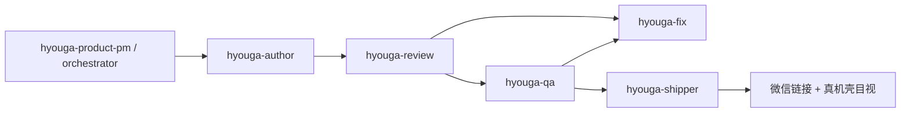

# 标日あと学習 · 项目级 Skill 清单（小程序形态 H5）

> **产品形态**：学员侧为 **微信内 https 链接** 打开的 **静态 H5**；开发验收须在 **390×844 真机壳**（`cursor-miniapp-phone.html?live=1`）内目视，与微信 WebView **同一视口**。  
> **真源**：[docs/学员端双界面显示标准-首要执行.md](../../docs/学员端双界面显示标准-首要执行.md) · `.cursor/rules/miniapp-real-device-preview-iron-law.mdc`  
> **3.0 包源**：`D:\【学习】\【李一舟】\_skills_extract\skills for 3.0学员`（或运行安装脚本自动解析）  
> **重装**：`python scripts/install-yizhou-3-skills.py`  
> **全量目录**： [docs/yizhou-3.0-skills-INDEX.md](../../docs/yizhou-3.0-skills-INDEX.md)

---

## 一、本「小程序」特点 · Skill 派单前提

| 特点 | 含义 | Skill 派单时必须遵守 |
|------|------|----------------------|
| **双界面交付** | ① Cursor 真机壳 390×844 · ② 微信可转发 https | 改 UI 用 **browser-automation** / 真机链；声称修好前过 **agent-eval-loop** + `发布前自检.bat` |
| **WebView 视口** | 内容区约 753×390；`miniappPreview=1`；底栏/顶栏固定 | **advanced-xhs-visual-design** 出稿按竖屏卡片；禁止桌面全宽验收 |
| **链接发行** | 公网 `index.html?v=CACHE_VER`；非 localhost 当学员方案 | **hyouga-shipper** 发链；**workflow-automation-builder** 维护 bat 流水线 |
| **四关课内** | 単語 / 文法 / 会話 / 测验；会話 ABC + TTS | **hyouga-author** + 日文知识库；**learning-loop** 延伸练习设计 |
| **学习の道首页** | 地图 + 目录真源 `curriculum-catalog.js` | **edu-app-paradigm** · **course-design-agent** |
| **100% 海星** | 听/说/读/场景/测验；无「写」维度 | **agent-eval-loop** 验收表对齐五维，勿加 writing 星 |
| **讨论优先** | 新需求先纪要/拍板再改码 | **meeting-notes-actions** · **hyouga-product-pm** |
| **文递自归** | 增量 diff；不整站重写 | **context-engineering-agent** 读 `iteration-baseline.json` |
| **未来小程序壳** | `japanese_learning_miniapp/` 仅 web-view 壳；H5 与公网一致 | 改链只动 `js/public-url.config.js` + `CACHE_VER` |

### 双界面 · 固定链接（派单/验收引用）

| 界面 | URL |
|------|-----|
| **真机壳（改 UI 必开）** | `http://127.0.0.1:8765/cursor-miniapp-phone.html?live=1` |
| **通道 A（数据对照）** | `http://localhost:8765/index.html?v={CACHE_VER}` |
| **微信学员链** | `https://saivenwang-byte.github.io/XiaoWangXueRiyu-v2/index.html?v={CACHE_VER}` |

当前 `CACHE_VER` 见 `js/share-wechat.js` · `docs/iteration-baseline.json` → `current.cache`。

---

## 二、Skill 总览

| 类别 | 本项目 `.cursor/skills/` | 全局 `~/.cursor/skills/` |
|------|--------------------------|---------------------------|
| **3.0 精选** | **20** | **55**（全量） |
| **hyouga 流水线** | **8** | —（仅本仓库） |
| **教学范式** | **1** `edu-app-paradigm` | — |

**合计本项目可触发**：29 个目录（20 + 8 + 1）。

---

## 三、按小程序产品域 · Skill 路由

| 产品域 | 学员在壳内看到什么 | 优先 Skill | 关键真源 |
|--------|-------------------|------------|----------|
| **P0 开机** | splash → 进入学习 | hook-angle-lab · advanced-xhs-visual-design · yizhou-ppt | `home-splash.js` · `assets/splash/` |
| **学习の道** | 地图、四岛、课 pill | edu-app-paradigm · course-design-agent | `curriculum-catalog.js` · `journey-home.js` |
| **00 入門** | 五十音、先生卡 | course-design-agent · brand-voice-system | `intro-guide.js` · `intro-kana-tips.js` |
| **课内四关** | 単語/文法/会話/测验 Tab | hyouga-author · learning-loop | `lessons-data.js` · `dialogue-gate.js` |
| **会話 ABC** | A/B/C 三档 + 评语 | hyouga-author · agent-eval-loop | `*-dialogue-abc.js` |
| **单元四格漫画** | 条带 4 泡 + zoom 高光 | advanced-xhs-visual-design · browser-automation | `unit-strip-storyboard.js` · `story-comic-ui.js` |
| **笔记·黄卡** | VOCAB/GRAMMAR/会話卡 | hyouga-author · context-engineering-agent | `*-knowledge-tips.js` |
| **语音 🔊** | TTS 缓存播放 | hyouga-review · workflow-automation-builder | `tts-cache/` · `docs/tts-registry.json` |
| **进度·海星** | 封面五星、单元折叠 | edu-app-paradigm | `mvp-storage.js` |
| **マイ** | 督导（待建） | hyouga-product-pm · yizhou-thinking | 纪要 P1b |
| **分享发链** | 📤 / share.html | hyouga-shipper · brand-voice-system | `share-wechat.js` |

---

## 四、hyouga 流水线 · 小程序交付链

与 [docs/Agent流水线-多角色分工.md](../../docs/Agent流水线-多角色分工.md) 一一对应。



| Skill | 小程序场景 | 硬闸门 |
|-------|------------|--------|
| **hyouga-product-pm** | 全局 IA、底栏、入門模组、Skill 派单 | 讨论优先；出讨论稿再 implement |
| **hyouga-orchestrator** | 拆 `docs/tasks/*.json`、多 Agent 并行 | 读 `iteration-baseline.json` |
| **hyouga-author** | 改 data / 四关 / UI / TTS 文案 | ICE ≤ L2；改 UI 前开真机壳 |
| **hyouga-review** | pre-ship、日文、TTS 对账 | `发布前自检.bat` |
| **hyouga-qa** | 四关冒烟、双通道 | 390×844 内操作一遍 |
| **hyouga-fix** | Review/QA FAIL 后最小 diff | 修完必须复验 |
| **hyouga-shipper** | bump cache、交付块、公网链 | 未全 OK 禁止声称已发布 |
| **hyouga-auditor** | Review+QA 合体一键 | 同 review + qa |
| **edu-app-paradigm** | 目录/地图/四关/海星范式 | 禁止超市式课表首页 |

**触发示例**：「按流水线改 L9 会話」「pre-ship 检查」「发微信链接」→ 对应 hyouga-*。

---

## 五、3.0 Skill 包 · 按文件夹（小程序映射）

### 01 — AI 增强

| Skill | 小程序何时用 | 触发说法 |
|-------|--------------|----------|
| ✅ **context-engineering-agent** | 新轮次改仓前整理 confirmed/backlog、Agent 记忆包 | 「整理上下文包」「对齐 iteration-baseline」 |
| ✅ **agent-eval-loop** | 设计交付自检表（R1–R12、四关、TTS=0） | 「出验收表」「eval loop」 |
| ✅ **multi-agent-orchestrator** | 大需求拆 PM/Dev/Review/QA | 「多 Agent 分工」 |
| ✅ **active-agent** | 用户已拍板后的批量补全（如 L1–24 精写流水线） | 「直接帮我做」「按纪要 100% 完成」 |
| ✅ **skill-finder** | 缺能力时从 55 技能里补装 | 「有没有 skill 能…」 |

### 02 — 内容创作

| Skill | 小程序何时用 | 触发说法 |
|-------|--------------|----------|
| ✅ **advanced-xhs-visual-design** | 开机图、四格漫画、分享卡片、390 宽竖屏 prompt | 「高级图文」「做小红书风卡片」 |
| ✅ **brand-voice-system** | 入門/分享/引导文案；禁用 AI 腔 | 「标日あと 语气」「品牌声纹」 |
| ✅ **hook-angle-lab** | 开机副标、入門钩子、转发语 | 「钩子」「点击理由」 |
| ✅ **course-design-agent** | 单元/课序/入門 SK 模组结构 | 「课程大纲」「教学结构」 |

### 03 — 开发工具

| Skill | 小程序何时用 | 触发说法 |
|-------|--------------|----------|
| ✅ **repo-context-compiler** | 为新 Agent 生成模块图（data/js/css 边界） | 「编译仓库上下文」 |
| ✅ **code-review-ci** | PR / GitHub Actions 失败 | 「CI 挂了」「review PR」 |
| ✅ **skill-creator** | 新增 hyouga 子 skill 或项目规则 | 「写一个 skill」 |
| ✅ **skill-vetter** | 安装外部 skill 前安全审查 | 「审查这个 skill」 |

### 04 — 浏览器自动化

| Skill | 小程序何时用 | 触发说法 |
|-------|--------------|----------|
| ✅ **browser-automation** | 真机壳内点击、四关切换、截图留证 | 「打开真机预览测一遍」 |

> 优先 URL：`cursor-miniapp-phone.html?live=1`；勿用全宽浏览器代替 L1–L3 验收。

### 06 — 知识与学习

| Skill | 小程序何时用 | 触发说法 |
|-------|--------------|----------|
| ✅ **learning-loop** | 把课文/黄卡延伸为练习、错题、复盘 | 「学习闭环」「课后练习」 |
| ✅ **yizhou-thinking** | 发版节奏、是否做小程序原生、商业化取舍 | 「该不该做」「一舟思考」 |
| ✅ **meeting-notes-actions** | 纪要 → 待拍板 / 行动项 | 「从纪要提取任务」 |

### 07 — 效率工具

| Skill | 小程序何时用 | 触发说法 |
|-------|--------------|----------|
| ✅ **yizhou-ppt** | 给美工/合作方的视觉说明、情绪板 | 「一页纸视觉说明」 |
| ✅ **editable-pptx-builder** | 可编辑 PPT 结构 + 页级文案 | 「PPT 交付美工」 |
| ✅ **workflow-automation-builder** | bat 流水线（发布前自检、TTS、ABC 导出） | 「自动化工作流」 |

### 05 / 08 — 未装入本项目（全局可用）

| 文件夹 | 代表 Skill | 与本小程序关系 |
|--------|------------|------------------|
| 05-社交媒体 | wechat-mp-auto · xiaohongshu-auto | **运营期**公众号/小红书；非课内运行时 |
| 08-数据分析 | spreadsheet-analyst · finance-assistant | 经营复盘；与学员端 H5 无直接耦合 |

需要时从 `~/.cursor/skills/` 直接触发，不必复制进本仓库。

---

## 六、典型任务 → Skill 组合

| 任务 | 推荐 Skill 链 | 小程序注意 |
|------|---------------|------------|
| 改底栏/笔记 UI | product-pm → author → browser-automation → review | 壳尺寸不变 L3 |
| 补第 N 课会話 ABC | author → review（TTS 对账）→ qa | B/C 须与 A 可见差异 |
| 做开机/new splash | hook-angle-lab → advanced-xhs-visual-design → author | 首屏 `100dvh−顶栏−底栏` |
| 批量 L1–24 内容 | active-agent → workflow（ship-l1-depth-full）→ auditor | 跑完 bump CACHE_VER |
| 发版给学员 | shipper → pre-ship → 真机壳 + 微信抽样 | push 须用户明说 |
| 新 Agent 接手 | context-engineering-agent → repo-context-compiler | 附双界面链接与 cache |

---

## 七、安装与维护

```bat
:: 从 3.0 zip 安装（全局 55 + 本项目 20）
python scripts/install-yizhou-3-skills.py
```

| 输出 | 路径 |
|------|------|
| 全局技能 | `%USERPROFILE%\.cursor\skills\` |
| 项目技能 | `.cursor/skills/{skill-name}/SKILL.md` |
| 安装记录 | `%USERPROFILE%\.cursor\skills\yizhou-3.0-installed.txt` |
| 55 技能目录 | `docs/yizhou-3.0-skills-INDEX.md` |
| 撰写规范 | `docs/yizhou-3.0-skill撰写规范.md` |
| PM 路由表 | `.cursor/skills/hyouga-product-pm/reference-skill-routing.md` |

**源路径优先级**（脚本自动）：  
`【学习】\【李一舟】\_skills_extract\…` → `【学习】\【李一舟】\skills for 3.0学员\…` → `【软件】\Skill\…`

---

## 八、Agent 禁止误用

- 未拍板不得用 **active-agent** 扩 scope（讨论优先铁律）。
- 未跑 **pre-ship** 不得用 **hyouga-shipper** 发「最终版」链。
- 改 UI 不得跳过 **390×844 真机壳**（仅 **browser-automation** 全宽 ≠ 交付）。
- **skill-creator** 新建 skill 时须 **skill-vetter** 过一遍再入库。
- 企业微信小程序 **未上线**；学员方案永远是 **https H5 链接**（见 production-netlify 规则）。

---

## 九、快速索引 · 文件夹 ✅ 清单

```
01-AI增强      active-agent · agent-eval-loop · context-engineering-agent
               multi-agent-orchestrator · skill-finder
02-内容创作    advanced-xhs-visual-design · brand-voice-system
               course-design-agent · hook-angle-lab
03-开发工具    code-review-ci · repo-context-compiler · skill-creator · skill-vetter
04-浏览器      browser-automation
06-知识学习    learning-loop · meeting-notes-actions · yizhou-thinking
07-效率工具    editable-pptx-builder · workflow-automation-builder · yizhou-ppt

项目专属       hyouga-orchestrator · hyouga-author · hyouga-review · hyouga-qa
               hyouga-auditor · hyouga-fix · hyouga-shipper · hyouga-product-pm
               edu-app-paradigm
```

---

*本文档随小程序形态与 3.0 包更新；机器安装清单见 `PROJECT-SKILLS-INSTALLED.txt`（安装脚本生成）。*
