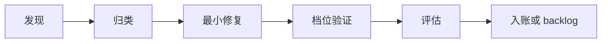

# C · 工程交付范式 · 发现 · 解决 · 评估 · 意见收纳 · 收官

> **用途**：回答「材料从哪来、问题怎么来、怎么修、怎么验、意见怎么收、每阶段收官做什么」。  
> **硬闸门真源**：[`Agent交付前工作流.md`](../Agent交付前工作流.md) · [`Agent文递自归.md`](../Agent文递自归.md)

---

## 一、材料从哪来（真源地图）

| 材料类型 | 真源位置 | 何时读 |
|----------|----------|--------|
| **用户意图（未入账）** | 当前消息、截图 | 每轮 Phase0 |
| **已拍板需求** | `iteration-baseline.json` → `confirmed[]` | 改码前 CONFIRM-C |
| **待做 backlog** | `backlog[]` | 禁止擅自提前做 |
| **产品愿景** | `我们-产品愿景-学习の道.md` | 改 IA/地图 |
| **UI 目视** | `学员端显示界面要求-会议纪要汇编.md` §0 | 刷新/声称 UI OK 前 |
| **课序/发布** | `curriculum-catalog.js` | 改首页/解锁课 |
| **课内数据** | `lessons-*.js` · `*-knowledge-tips.js` · `*-dialogue-abc.js` | 改内容 |
| **PRD 文稿** | 产品 PRD 目录 / generate 输入 | 播种 wave |
| **TTS** | `tts-registry.json` · `tts-cache/` | 改日文朗读 |
| **踩坑** | `Agent交付前工作流-记忆库.md` | 同类 bug 复发 |
| **版本** | `version-history.json` · `VERSION.md` | 发链/收官 |
| **决策考古** | `过程讨论内容/01–19…` | 追问「当时为什么」 |

---

## 二、发现问题 → 解决 → 评估（闭环）

### 2.1 发现（渠道）

| 渠道 | 典型信号 | 工具/动作 |
|------|----------|-----------|
| **用户** | 截图、原话、「不对」 | 讨论优先 · 不入码直到拍板 |
| **机器** | pre-ship `[FAIL]` | `发布前自检.bat` |
| **审计** | ABC/TTS/日文/PRD | `audit-*.py` → `docs/*-最新.md` |
| **开发** | 控制台报错、白屏 | 8765 本地 + 真机壳 |
| **双通道** | 壳内 OK、微信不行 | 4G 公网链 · TTS 源 · 缓存 `?v=` |
| **回归** | 改 A 坏 B | L3 四关冒烟 · regression lesson 14 |

### 2.2 归类（决定 ICE 档位）

| 类型 | 档位 | 例 |
|------|------|-----|
| 文案笔误 | L1 | 单字段 zh |
| 单关 UI | L2 | 单词卡样式 |
| 会話+TTS | L3 | speech-engine · shadow-speak |
| 已批 P0 方案 | L4 | 笔记六维改版 |
| 删 Tab / 换 IA | L5 | 须用户逐条 |

### 2.3 解决（原则）

1. **根因优先** — 不贴 UI 补丁掩盖 data/编码问题  
2. **最小 diff** — 不动冻结范围（会話 §4.1 · L1 五关壳 · cover-base）  
3. **脚本对账** — TTS/PRD 不手查  
4. **UTF-8** — 中文 HTML 禁止 PowerShell 无 BOM 批量替换（R9）

### 2.4 评估（通过标准）

| 层级 | 通过标准 |
|------|----------|
| L1–L2 | 相关 1 项冒烟 OK |
| L3 | `pre-ship-check.py` 全 `[OK]` + 四关挂载 |
| UI | 汇编 §0 R1–R13 + 390×844 壳 L3 |
| 发链 | pre-ship + 双通道目视 + 交付反馈块 |
| 收官 | [E 文档](./E-本案实例-标日阶段与收官.md) §收官动作 |

---

## 三、意见收纳 · 宽度与平选标准

### 3.1 收纳宽度

| 宽度 | 定义 | 落点 |
|------|------|------|
| **铁律** | 违反则交付无效 | `.cursor/rules/*.mdc` |
| **范式** | 跨阶段、跨课 | `docs/范式体系/*` |
| **纪要** | 单次拍板、带日期 | `过程讨论内容/` · 汇编 § |
| **机器** | 可脚本化 | `pre-ship-check.py` · audit |
| **会话** | 一次性 | 聊天，不入 confirmed |
| **待拍板** | 新想法未确认 | 汇编 §待拍板 · backlog planned |

### 3.2 入选 `confirmed[]` 平选标准（须全满足）

| # | 标准 |
|---|------|
| 1 | 用户**明示**或纪要标记 **✅ 拍板** |
| 2 | **可验收** — 一句话 + 目视或脚本 |
| 3 | **since_cache** — 从哪版起生效 |
| 4 | **files[]** — 涉及路径可回归 |
| 5 | **不冲突** — 更高铁律（讨论优先、冻结会話、MVP 课内） |

### 3.3 入选 `backlog[]` 标准

- 用户**同意方向**但未排期  
- 或 Agent 建议 **须讨论** 的增强  
- **status**：`planned` / `deferred` / `in_progress` / `done` / `content_done`

### 3.4 不入库

- Agent 脑补需求  
- 未跑通 seed 的「24 课全金标」  
- 与发心冲突的「纯装饰大改」

---

## 四、各阶段 · 我们要求什么 · 收官动作

| Phase | 我们要求 | 阶段收官动作 | 检验标准 |
|-------|----------|--------------|----------|
| **0 愿景** | 课序表、三层 IA、游戏化边界写清 | 纪要拍板 + 愿景 md | 团队复述一致 |
| **1 种子** | 1–3 课四关数据+UI 可冒烟 | 金标课定稿 | 无白屏 · 四关可进 |
| **2 冻结** | 课内不改；tag | `git tag` · MVP-FREEZE | confirmed 含冻结 id |
| **3 播种** | Wave + audit + TTS 0 缺失 | bump cache · push | pre-ship 绿 · audit 报告 |
| **4 体验** | 真机/微信/录音/TTS 链 | v409–410 类补丁 | 用户截图问题关闭 |
| **5 双通道** | 壳 + 公网同一 CACHE_VER | 汇编 §0 目视 | R1–R13 |
| **6 收官** | 文档真源 + tag + 双推 | 收官报告 · 手机清单 · tag | 见 E 文档 |

---

## 五、收官动作清单（Phase 6 · 本案 v410）

| # | 动作 | 产出 |
|---|------|------|
| 1 | `发布前自检.bat` 全 OK | 机器表 |
| 2 | 写收官报告 | `L1-24-收官报告-v410.md` |
| 3 | 更新手机验收清单 | `L1-24-手机验收清单-v410.md` |
| 4 | 同步 VERSION · PROJECT_SPEC · version-history · baseline | 真源一致 |
| 5 | `git commit` + 双推 v2 + gitee | remote 同步 |
| 6 | `git tag v1.0.2-ship-v410` + push tag | 可 Releases |
| 7 | （可选）Gitee Pages 开通 | 国内链 HTTP 200 |
| 8 | 手机 4G 抽样 | 作者目视签字 |

**不得宣称收官**：pre-ship 有 FAIL · 仅 localhost · 未更新 `?v=` · 未写报告。

---

## 六、评估意见质量（Review 视角）

| 维度 | 好意见 | 差意见 |
|------|--------|--------|
| **可验收** | 「CTA 下移 20px 不挡 02」 | 「再好看一点」 |
| **锚定发心** | 「学习优先：评语只留当前句」 | 「加更多动画」 |
| **范围** | 「只改 splash CSS」 | 「顺便重构 app.js」 |
| **真源** | 链纪要/截图/课号 | 「我觉得应该」 |
| **档位** | 明确 L1–L3 | 默认 L5 大改 |

PM/Review Agent（`hyouga-review`）按上表过滤；未达标的退回讨论。

---

## 七、与文递自归的关系

| 机制 | 管什么 |
|------|--------|
| **讨论优先** | 本轮**新**意图 |
| **文递自归** | **已确认**上下文上的 diff |
| **意见平选** | 什么能进 confirmed |
| **pre-ship** | 机器是否允许 ship |
| **双通道** | 人眼是否允许 ship |

四者都过，才可对用户说「收官 / 可发链」。
